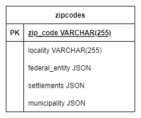

# ZipCodesChallenge
## Resolución del problema

Para resolver el problema de los códigos postales, cuya página proporcionada por el gobierno **no ofrece una api**, busqué en primer lugar la forma de obtener esos datos. Realicé la descarga de un archivo .xml con el concentrado de todos los códigos, sus asentamientos, localidades, municipios, etc. 

A partir de ahí, el enfoque que tomé para obtener estos códigos fue simple: recorrer el archivo .xml y filtrar los códigos postales repetidos para que se fuera haciendo un acumulado de asentamientos y así poder guardarlos sin tener que repetir el CP en la base de datos. Esto lo hago en el seeder ZipCodesSeeder.

Al ser un proyecto demostrativo, la arquitectura para el proyecto es simple: una base de datos para guardar estos códigos y poder consultarlos utilizando como primary key su CP y la aplicación laravel para el desarrollo de la api. En la siguiente figura, se muestra la tabla utilizada para guardar la información. Como se puede observar, se guardaron los campos que tienen más de un atributo como json, esto para evitar crear más tablas o hacer que el algoritmo del seeder rebase la memoria del servidor al tratar de separar cada uno de los objetos. 

Después de tener en la base de datos todos los códigos postales y su información, definí un módelo de eloquent `App\Models\ZipCode`, que me ayudará a consultar la base de datos de una forma muy sencilla, utilizando únicamente la primary key (zip_code).

Luego creé el controlador `App\Htpp\ControllersZipController` para manejar la ruta get necesaria para el ejercicio. 

Por último, implementé un resource que me permite darle la forma  a la respuesta json como se espera en el api.

## Mejoras

- A pesar de tener un seeder que parsea el xml y guarda en la base de datos los cp en aproximadamente 2 minutos, no deja de ser posible su optimización mediante inserts de más de un registro (así disminuyen las consultas a la base de datos), o un algoritmo que parsee de mejor forma el xml para poder guardar ciudades, municipios,  asentamientos etc en tablas separadas, para poder realizar consultas por ejemplo de códigos postales por ciudad. Sin embargo, para este caso de uso, esta solución parecería ser adecuada. 

- Otro enfoque que podría ser provechoso sería el de hacer webscrapping a la página de gobierno. De esta forma, no sería necesario realizar ningún procesamiento de xml, sino más bien del html devuelto por la página. 

## Requerimientos
- Laravel 9
- MySQL 8.0+
- Docker 20.0+
- Docker Desktop 4.0+

### Ejecución local con Docker
1. Crear el archivo `.env` como el que se muestra en el ejemplo. La base de datos lleva por nombre `zipCodes`, así que es necesario actualizar la variable DB_DATABASE con este valor y las credenciales son root y null. 
2. Crear el archivo `.env.prod`, tiene las mismas variables que el .env, pero la base de datos debe apuntar a la base que se usará en producción.
3. Ejecutar el comando `docker-compose up --build`.
4. Una vez construidas las imágenes, entrar al cli del contenedor app. Esto puede hacerse mediante Docker Desktop.
5. Una vez dentro, ejecutar el comando `php artisan migrate`
6. Ejecutar el comando `php artisan db:seed --class=ZipCodesSeeder`. Esto puede llevar unos minutos.

### Ejecución local con Laragon
1. Crear el archivo `.env` como el que se muestra en el ejemplo.
2. Crear el archivo `.env.prod`, tiene las mismas variables que el .env, pero la base de datos debe apuntar a la base que se usará en producción.
3. En Laragon, entrar a prefences y en el campo Document Root, apuntas a la carpeta public del proyecto.
4. Iniciar mysql y crear la base de datos.
5. Actualizar el `.env` con los datos de mysql necesarios.
6. Iniciar APACHE.
7. Ejecutar el comando `php artisan migrate`
8. Ejecutar el comando `php artisan db:seed --class=ZipCodesSeeder`. Esto puede llevar unos minutos.

